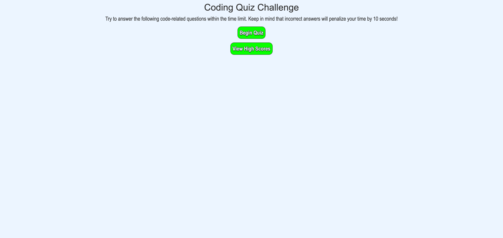
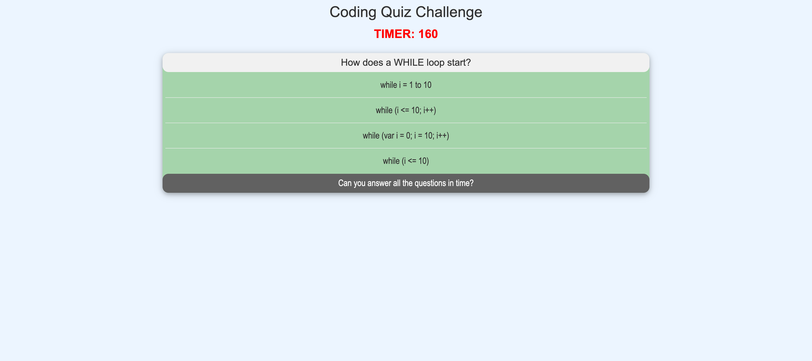
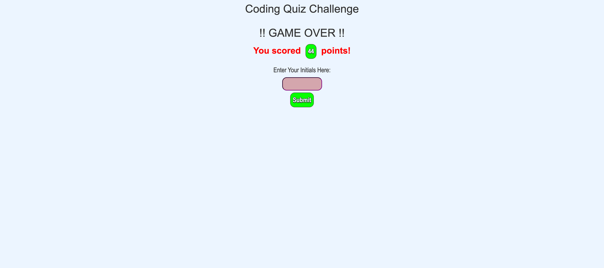
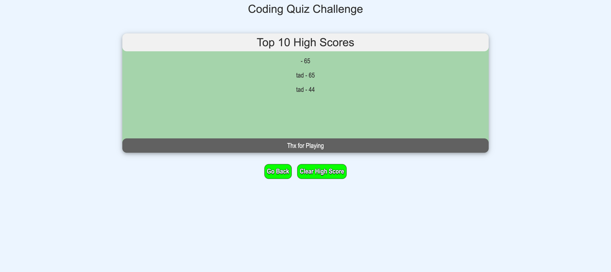

# Code Quiz

## Decsription

- This game allows for the testing of JavaScript terms knowledge. Questions will be asked and the timer will begin. When a question is answered incorrectly the time will be reduced faster.

- When the quiz ends you will be given a score and be able to add it to the High Scores list. You will be able to see other high scores also.

- When finished you may start a new game.

## Mock-up

<!-- Main Screen  -->

<!-- Questions Screen -->

<!-- Game Over -->

<!-- High Scores -->

